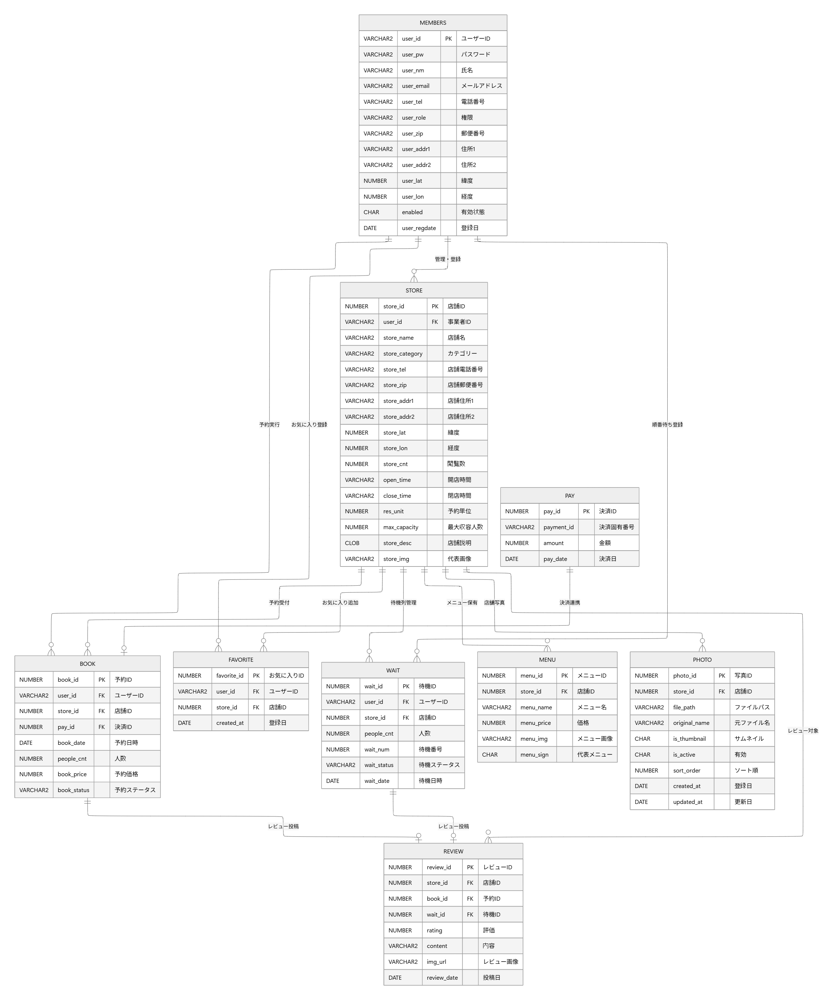

# Gourmet Pass
GourmetPass は、飲食店検索・予約・ウェイティング管理・レビュー投稿・お気に入り管理・決済連携を提供する Spring MVC ベースの Web アプリケーションです。  
本システムでは、一般ユーザーと店舗オーナーの権限を明確に分離し、運用時の安全性と保守性を両立しています。

## Table of Contents
- [プロジェクト概要](#プロジェクト概要)
- [技術スタック](#技術スタック)
- [主要機能](#主要機能)
- [ディレクトリ構成](#ディレクトリ構成)
- [ERD](#erd)
- [ローカル実行手順](#ローカル実行手順)
- [環境設定 (`api.properties`)](#環境設定-apiproperties)
- [セキュリティおよび運用上の注意](#セキュリティおよび運用上の注意)
- [トラブルシューティング](#トラブルシューティング)

---

## プロジェクト概要
- ユーザー向け機能: 店舗検索、予約/ウェイティング、レビュー、お気に入り、決済
- オーナー向け機能: 店舗/メニュー管理、予約・待機列ステータス管理
- 認証/認可: Spring Security によるロールベースアクセス制御（USER / OWNER）

## 技術スタック
- **Language**: Java 8
- **Framework**: Spring MVC 5.3.x, Spring Security 5.3.x
- **Persistence**: MyBatis 3.5.x, Oracle JDBC, HikariCP, PageHelper
- **View**: JSP, JSTL
- **Build/Deploy**: Maven (WAR), Tomcat 9+
- **Etc**: Log4j2, Spring WebSocket

## 主要機能
### 1) 会員
- 一般/オーナー会員登録
- ログイン/ログアウト
- マイページ編集
- アカウント検索
- ソーシャルログイン（Kakao / Google）

### 2) 店舗
- 店舗一覧/詳細表示
- 店舗登録・更新
- メニュー登録・更新・削除
- 画像アップロードおよびサムネイル管理

### 3) 予約・ウェイティング
- 予約登録および状態更新
- ウェイティング登録・キャンセル・呼び出し状態変更

### 4) 付帯機能
- レビュー投稿/一覧/削除
- お気に入り登録/解除
- 決済完了・返金 API

## ディレクトリ構成
```text
src/main/java/com/uhi/gourmet
├── common     # 共通設定/コントローラー/WebSocket
├── member     # 会員/認証/ソーシャル連携
├── store      # 店舗
├── menu       # メニュー
├── favorite   # お気に入り
├── photo      # 画像/サムネイル管理
├── book       # 予約ドメイン
├── pay        # 決済
├── wait       # ウェイティング
└── review     # レビュー

src/main/resources
└── mapper      # MyBatis Mapper XML（DB 連携）

src/main/webapp/WEB-INF
├── spring      # Spring / Security 設定
└── views       # JSP ビュー
```

## ERD


## ローカル実行手順
### 1. 前提条件
- JDK 8
- Maven 3.8+
- Oracle Database
- Tomcat 9+

### 2. ビルド
```bash
mvn clean package
```

ビルド成功時、`target/app-1.0.5.war` が生成されます。

### 3. 起動
1. `target/app-1.0.5.war` を Tomcat の `webapps/` に配置
2. または IDE（IntelliJ / Eclipse）から Tomcat Run Configuration で起動
3. ブラウザで `/` にアクセス

## 環境設定 (`api.properties`)
`src/main/resources/api.properties` を作成し、以下を設定してください。

```properties
# Database Configuration
db.driver=YOUR_DB_DRIVER
db.url=YOUR_DB_URL
db.username=YOUR_DB_USERNAME
db.password=YOUR_DB_PASSWORD

# Resource Paths
upload.path=file:/C:/uploadgourmetpass/
# 実運用環境の絶対パスを直接指定してください

# Kakao API Keys
kakao.js.key=YOUR_KAKAO_JS_KEY

# PortOne
portone.store.id=YOUR_PORTONE_STORE_ID
portone.channel.key=YOUR_PORTONE_CHANNEL_KEY
portone.api.secret=YOUR_PORTONE_API_SECRET

# Google OAuth
google.oauth.client-id=YOUR_GOOGLE_CLIENT_ID
google.oauth.client-secret=YOUR_GOOGLE_CLIENT_SECRET
google.oauth.redirect-uri=YOUR_GOOGLE_REDIRECT_URI

# Kakao OAuth
kakao.oauth.client-id=YOUR_KAKAO_CLIENT_ID
kakao.oauth.client-secret=YOUR_KAKAO_CLIENT_SECRET
kakao.oauth.redirect-uri=YOUR_KAKAO_REDIRECT_URI

# Optional
book.debug.mode=true
```

> 機密情報（API キー、シークレット、パスワード）は README やソースコードへ直接記載せず、環境変数またはシークレット管理基盤で管理してください。

## セキュリティおよび運用上の注意
- Spring Security により URL ごとのアクセス権限を制御しています。
- CSRF が有効なため、フォーム送信および非同期通信でトークン処理が必要です。
- CORS は現状ワイドに設定されているため、本番環境では許可オリジンを明示的に制限してください。
- ログ出力時に個人情報や認証情報が含まれないよう運用ルールを整備してください。

## トラブルシューティング
- **DB 接続エラー**: `db.*` の値、Oracle 接続先、アカウント権限を確認
- **アップロード失敗**: `upload.path` の存在、書き込み権限、OS パス形式を確認
- **OAuth 連携失敗**: Provider 側の Redirect URI と設定値の一致を確認
- **決済 API エラー**: PortOne 認証情報、サーバー時刻、ネットワーク到達性を確認

---
運用ドキュメント（API 仕様、障害対応フロー、デプロイ標準手順）が必要な場合は、本 README を起点として別ドキュメントへ分離する運用を推奨します。